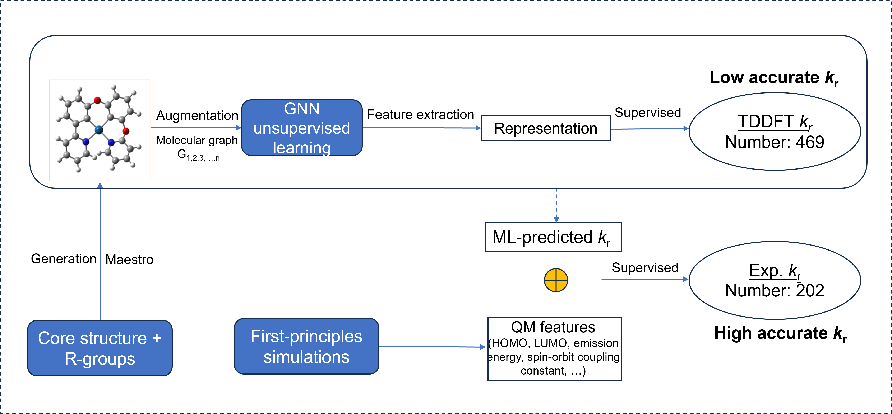

# Multi-level Δ-learning for Predicting Experimental Radiative Decay Rate Constant of Phosphorescent Platinum(II) Complexes


<p align='center'>
  
</p>

## Abstract
The utilization of phosphorescent metal complexes as emissive dopants for organic light-emitting diodes (OLEDs) has been the subject of intense research. Cyclometalated Pt(II) complexes are particularly popular triplet emitters due to their color-tunable emissions. To make them viable for practical applications as OLED emitters, it is essential to develop Pt(II) complexes with high radiative decay rate constant (*k*<sub>r</sub>). To this end, an efficient and accurate prediction tool for small experimental *k*<sub>r</sub> sample is highly desirable. In this work, **two new datasets are established including 526K Pt-complexes structures and 467 first-principles calculated structures with simulated *k*<sub>r</sub> values**. We propose a general yet powerful **multi-level Δ-learning** protocol achieving high accuracy in predicting *k*<sub>r</sub> values. The structure of the protocol is exemplified with two major parts: a GNN semi-supervised regression model for first-principles calculated *k*<sub>r</sub> and a supervised regression model for experimental *k*<sub>r</sub>. The former model can be utilized for high throughput virtual screening (HTVS) while the latter for highly accurate *k*<sub>r</sub> predictions. **The multi-level Δ-learning approach offers a way of evaluating k<sub>r</sub> from different accuracy levels with more enhanced precision.** Besides, this work **first solves the problem of metal-complex representation via GNN considering coordination bonds**. Among 526K structures dataset, 52 new Pt-structures are screened out and their accurate evaluation results are presented. We expect this protocol will become a valuable tool for small sampling problems, expediting the rapid development of novel OLED materials and offering guidance for the future advancement of ML models for metal-complex systems.


## Requirements
GNN unsupervised contrastive learning:
numpy                     1.21.6 
python                    3.7.16   
rdkit                     2020.09.1 
scikit-learn              1.0.2      
scipy                     1.7.3   
tensorboard               1.15.0  
torch-geometric           2.0.0      
torch-scatter             2.0.9      
torch-sparse              0.6.12     
tqdm                      4.65.0   


ML-head and visualization:
Python                    3.7.0
rdkit                     2020.09.1.0
scikit-learn              0.23.2
hyperopt                  0.2.7
shap                      0.41.0
PDPbox                    0.2.1

Detials can be seen at environment_requirements.txt

## Dataset

The dataset directory should look like this:
```bash
├───code and related data
│   ├───ML-for-TDDFT-k_r
│   │   └───with_QM_data
│   ├───ML-for_experimental_k_r
│   │   ├───Shapley
│   │   └───tSNE
│   └───unsupervised contrastive learning
│       ├───get_learnt_features
│       │   ├───GCN
│       │   └───GIN
│       └───unsupervised_training
│           ├───ckpt
│           ├───dataset
│           ├───example_unlabelled_strcutures
│           ├───models
│           └───utils
└───figure 

```

## Usage

1.The data is set within each task.

## Results

```bash
# Results and trained models can be in each task and correlated part in the paper.

```

## Note

- The dataset, model, and code are for non-commercial research purposes only.
- If there are any questions, please contace me freely.
